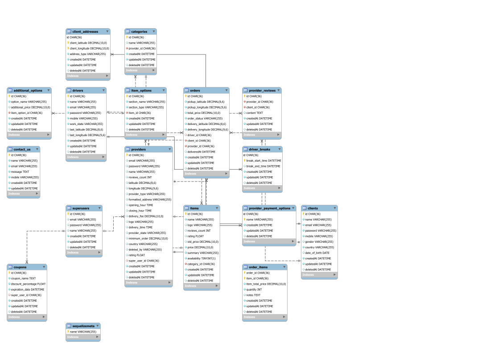
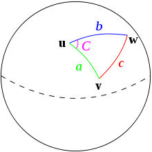

# Collection Link

https://www.postman.com/collections/58fcd795b14558feec6c
in postman you should disable ssl verification in order to get response

# Installation steps

1. $ git pull
2. $ npm install
3. you should extract .zip files ali send via whatsapp
4. edit config.json file inside db directory
5. $ sudo npm install -g --save-dev sequelize-cli
6. $ npx sequelize-cli db:migrate

# notes

to delete all migration $ npx sequelize-cli db:migrate:undo:all

# Things to document
 The harvsine algorithm

# Introduction

This project is a full on system which works similarly as talabat the delivery system we have the backend in this repo and the rest of the system is distributed through other repos which their links will be found at the end of the document, The system consists of a web frontend for:
- The service providers (Restaurants, Pharmacies,etc..)
- The Super users
- The clients/guests

also the system has a driver mobile application for the people which are responsible for delivery and a mobile application for the clients.

With that being said let's discuss the decisions taken in this project.

# Database
As seen in the given figure our database is quite big and complex 

the main focal point is the providers table we tried to generalize the provider as much as possible to allow further integrations of new providers, Instead of relying on unstructured databases such as mongoDB or other noSQL engines we segregated the choices into items and their respective item options this approach allowed us to have the flexibility when dealing with complex options in each set of items

The database is constructed using Sequelize ORM migrations to allow the ease of deployment, In the end section of improvements we will discuss the database further for some decisions that we were constrained in due to lack of resources.

## Sequelize

Our ORM of choice which is integrated well with nodejs allowed the ease of creating/dropping the database during development phase, Also the ORM deals with multiple database engines quite well with more options than we needed so it was a prime candidate for the project.

### Paranoid tables

Data is money and we aren't going to part with it easily so we set the tables as paranoid thus making the deletions in any crud operation a soft delete so we can restore it back at anytime this sets the use of hooks to segregate deletions but as the models are basically javascript classes this was an easy task to implement

# Design Decisions

There were multiple decisions taken to further enhance the system we will discuss them one by one 

## The haversine formula

The haversine formula is used to calculate the distance in miles/kilometers using latitude and longitude. This allowed us to calculate where the best driver is to deliver the a specific order and where are the providers near the client which they can deliver to him

## Winston

We used the famous logging library winston to log any errors or database information to a log file so the deployment logs can be found later on for inspection

## Jsonwebtoken

We use JSON web tokens for authorization across the application with middleware authentication for expressJS

## UUIDv4

We don't use incremental IDs as they are more vulnerable instead we opted to use UUIDs since they are more secure and using an indexed approach to it we will have the same performance as the incremental IDs

## Socket io

We used sockets in realtime tracking of driver and order each order is set inside a room with the name of the order ID and the client can join the room and listen to the emits of the driver to know the location exactly

# Folder structure

We used the repository design pattern and MVC in designing the system so all of database communication is in a single place that facilitates the unit testing of all the functions after mocking them 

Our API is set under version 1 to allow versioning for later developments and they everything is namespaced under it to facilitate additions and extensions of features

